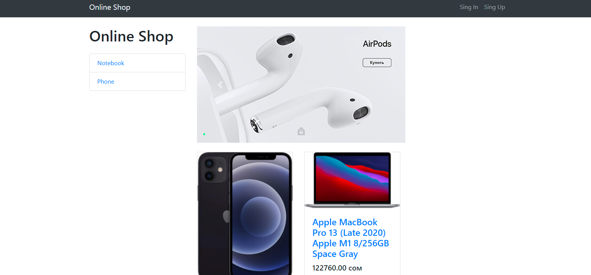
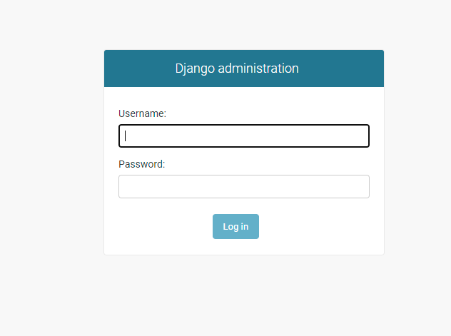
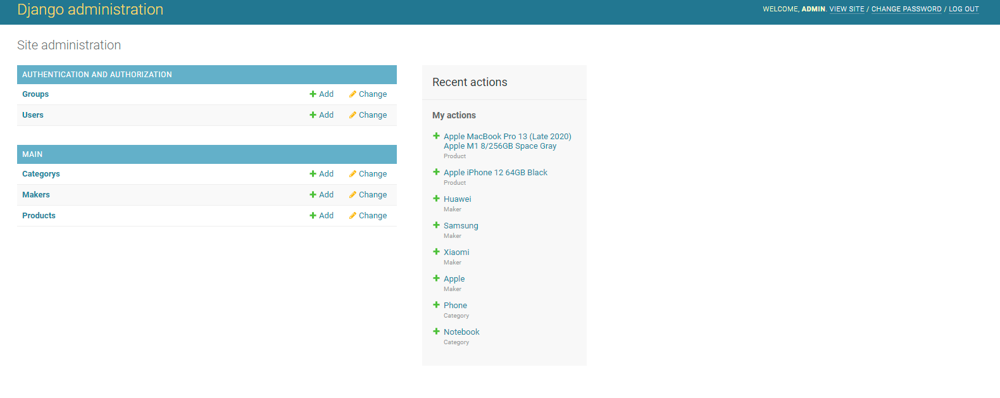
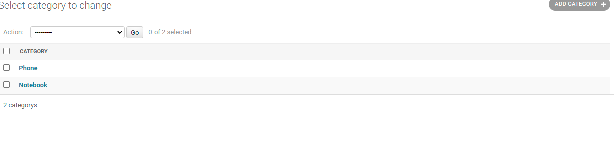
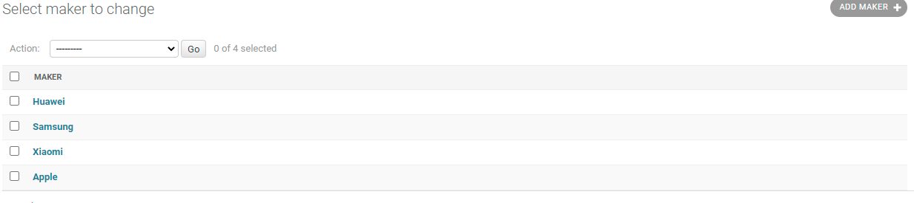
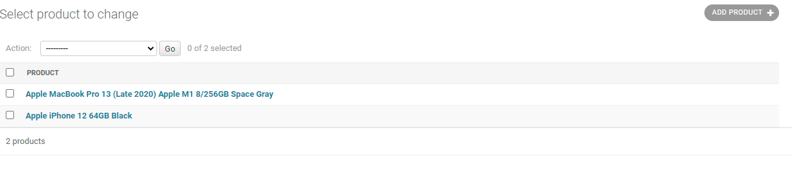

## Mini market
Это онлайн магазин техники. написан на Django.
Сайт был создан как тестовый проект для обучения по ТЗ.
Это был мой первый web service на Django.
Я с нуля сам смог освоить и изучить базовые знания джанго меньше чем за 2 недели.</br>

>Specification (Тех. Задание)</br>
Мини интернет магазин</br>
Базовый функционал и верстку без стилей, дизайн произвольный</br>
Регистрация (без подтверждения)</br>
Авторизация </br>
Изменение профиля</br>
Карточки товаров / страница товара</br>
Категории товаров</br>
Добавить README по поднятию проекта локально</br>

>Общие требования:</br>
Django 2.2+</br>
Python 3.6+</br>
Postgres</br>
Использовать VCS git т залить в репозиторий (github/gitlab/bitbucket)</br>
Время выполнения до 6 дней</br>

В данном проекте осуществлены все сервисы которые указаны в ТЗ.

---
Скачайте проект с GitHub:
[Установка проекта](https://github.com/double-bubble/shops/archive/master.zip) </br>
После скачивание нужно разархивировать папку:
- Кликнуть правой мышкой на скачанную zip папку (**shops-master.zip**).
- И выбрав из вышедшего списка команд (**Извлечь в текущую папку** или **Extract to the current folder**)
- После открыть папку с помощью **Текстового редактора** или **Командной строки**.
   
  - Пропишите в терминале команду если Linux OS:</br>
     ```
     $ pip3 install -r requirements.txt
     $ python3 manage.py runserver
     ```
   - Пропишите в терминале команду если Windows OS:</br>
     ```
     $ python -m pip install -U pip setuptools
     $ python manage.py runserver
     ```
     Если терминал командной строки:</br>
     ```
     $ python -m pip install -U pip setuptools
     $ pip install psycopg2
     $ python manage.py runserver
     ```

- После запуска сервера в терминале выйдет HOST **http://127.0.0.1:8000/**.
  Кликнем и перейдём в браузер. На главную страницу сайта: 
  На главной странице находятся **список Категорий и Товаров**, а так же **Слайдер**.

  
- Для добавления новых **Товаров, Категорий**, 
  мы должны перейти в админ панель по url адресу **http://127.0.0.1:8000/admin/**. Здесь мы должны **Войти** в админ панель:</br>
  username = **admin**
  password = **admin**
  
  

- После входа в админ панель мы увидим **Главную страницу** 
  где находятся все наши модели **Categories, Makers, Products**
  

- Чтоб добавить:
   - Новую **Категорию** нужно кликнуть на **Categorys**:
     
     Здесь уже находится две категории **Phone, Notebook**:</br>
     Для добавления новой категории нажмите в правом верхнем углу **ADD CATEGORY**.</br>
     И заполнить все поля.
     
   - Нового **Производителя** нужно кликнуть на **Makers**:
     
     Здесь уже находится четыре производителя **Apple, Huawei, Samsung, Xiaomi**:</br>
     Для добавления нового производителя нажмите в правом верхнем углу **ADD MAKER**.</br>
     И заполнить все поля.
     
   - Новый **Продукт** нужно кликнуть на **Products**:
     
     Здесь уже находится два продукта **Apple MacBook Pro 13, Apple iPhone 12 64GB Black**:</br>
     Для добавления новый продукт нажмите в правом верхнем углу **ADD PRODUCT**.</br>
     И заполнить все поля.
